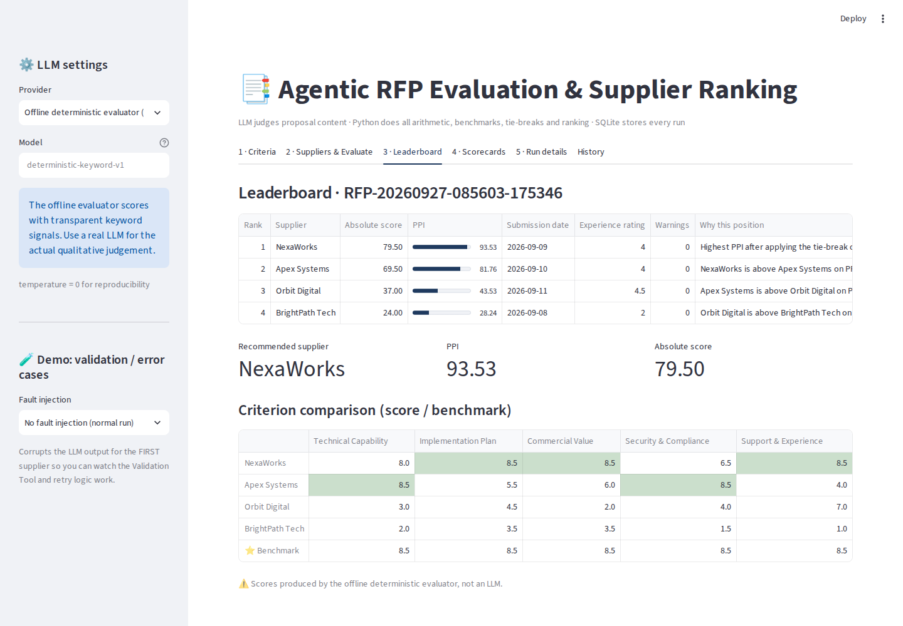
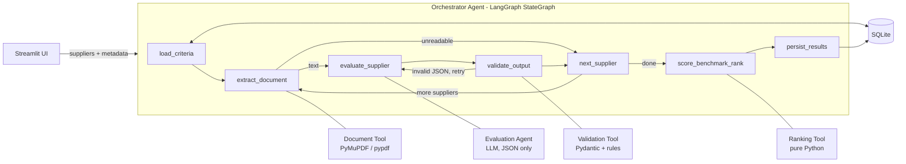
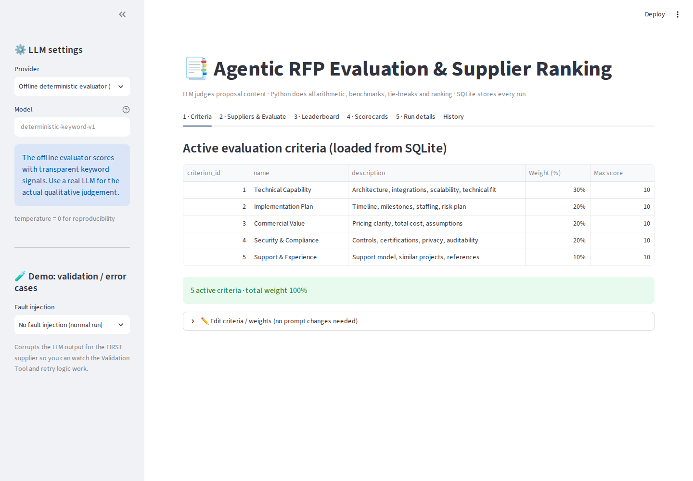
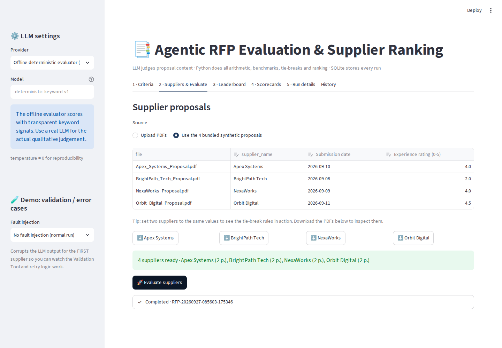
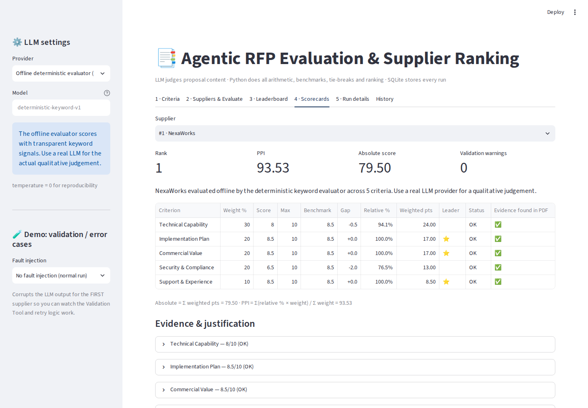
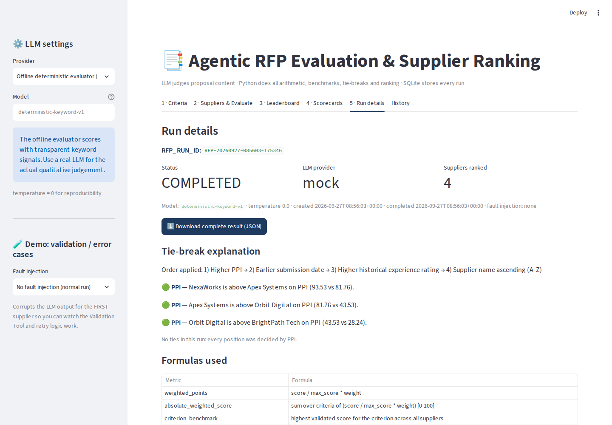
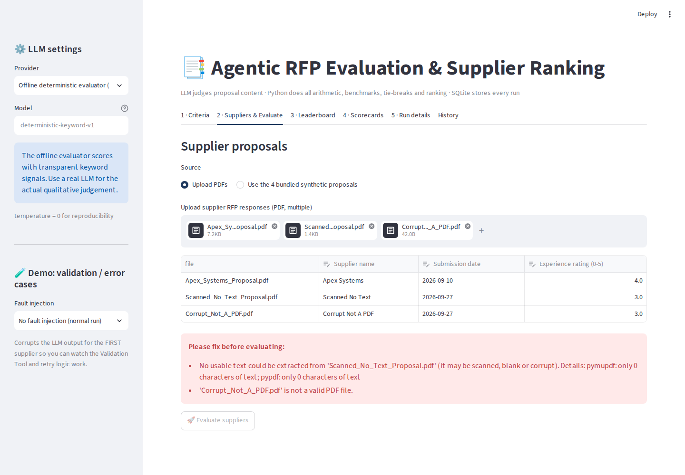

# Agentic RFP Evaluation & Supplier Ranking

An AI-assisted procurement tool. It reads supplier RFP responses (PDF), scores each one against
criteria stored in the database, benchmarks every supplier against its peers, and produces a
leaderboard where each rank can be explained.

**The LLM only judges the proposal content** (a score, a justification and a quoted piece of
evidence for each criterion). **Python does all of the arithmetic, benchmarking, tie-breaking and
ranking**, so the same validated scorecards always produce the same result.

- **Live app:** `https://npr9-rfp-evaluator-app-niajav.streamlit.app` ← *add after deployment*
- **Stack:** Streamlit · SQLite · LangGraph · PyMuPDF/pypdf · Pydantic · OpenAI / Anthropic / any
  OpenAI-compatible LLM (Groq, OpenRouter, Ollama)



---

## 1. Quick start

```bash
python -m venv .venv && source .venv/bin/activate      # Windows: .venv\Scripts\activate
pip install -r requirements.txt
python scripts/init_db.py                              # creates rfp_evaluation.db + 5 sample criteria
streamlit run app.py
```

In the sidebar, pick an LLM provider and paste an API key (or use `.streamlit/secrets.toml`, see
`.streamlit/secrets.toml.example`). Then:

1. **Criteria** tab: review or edit the criteria and weights. They must total 100%.
2. **Suppliers & Evaluate** tab: upload PDFs (or choose *Use the 4 bundled synthetic proposals*),
   check the metadata, and click **Evaluate suppliers**.
3. **Leaderboard**, **Scorecards** and **Run details** tabs: view the results and download the JSON.

There is also an **offline deterministic evaluator** (provider `mock`) that needs no API key. It is
used for tests and reproducible demos, and is clearly labelled wherever it appears in the UI.

Command-line run (no UI):

```bash
python scripts/run_cli.py --provider openai            # or anthropic / mock
python scripts/run_cli.py --provider mock --fault malformed_values --out sample_output/x.json
```

Tests:

```bash
pytest -q        # 32 tests: formulas, tie-breaks, validation, pipeline, DB, provider wiring
```

---

## 2. Architecture



| Component | File | Responsibility |
|---|---|---|
| Orchestrator Agent | `rfp/orchestrator.py` | LangGraph graph whose conditional edges decide the next step: retry on bad JSON, skip unreadable PDFs, loop over suppliers, abort on fatal errors |
| Document Tool | `rfp/tools/document_tool.py` | Extracts clean text with PyMuPDF (pypdf as fallback). Rejects files that aren't PDFs, are encrypted, or are scanned with no text |
| Evaluation Agent | `rfp/agents/evaluation_agent.py`, `rfp/prompts.py` | The **only** LLM call. The prompt is built from the active DB criteria at run time. temperature = 0, JSON mode |
| Validation Tool | `rfp/tools/validation_tool.py` | Parses the JSON, normalises it (clip, default, dedupe, drop unknown ids), checks each evidence quote against the PDF text, and records every fix as a warning |
| Ranking Tool | `rfp/tools/ranking_tool.py` | Weighted scores, benchmarks, gaps, relative %, PPI, tie-breaks and ranks. **No LLM** |
| Persistence | `rfp/db.py`, `sql/schema.sql` | Criteria, runs and supplier results. Every run is written in one transaction under one `RFP_RUN_ID` |
| UI | `app.py` | Criteria, supplier input and validation, leaderboard, scorecards, run details, history |

### How the 10 required steps map to the code

| # | Step | Where |
|---|---|---|
| 1 | Setup: load active criteria | `app.py` → `db.get_all_criteria()` |
| 2 | Input: PDFs and metadata | `app.py` tab 2 (name, submission date, experience 0-5, pre-checks on the PDFs) |
| 3 | Batch: create run id | `orchestrator.run_rfp_evaluation` → `db.create_run` (`RFP-YYYYMMDD-HHMMSS-XXXXXX`) |
| 4 | Evaluate: reload criteria, extract, prompt, call LLM | nodes `load_criteria`, `extract_document`, `evaluate_supplier` |
| 5 | Validate | node `validate_output` → `parse_llm_json` + `normalize_scorecard` |
| 6 | Score | `ranking_tool.rank_suppliers` (absolute weighted score) |
| 7 | Benchmark | `ranking_tool.compute_benchmarks` |
| 8 | Rank | `ranking_tool.sort_key` + `_explain_pair` |
| 9 | Persist | node `persist_results` → `db.persist_run_results` |
| 10 | Present | `app.py` tabs 3-5, JSON download |

---

## 3. Formulas

Symbols: `s` is a supplier's validated score on a criterion, `m` is that criterion's max score,
`w` is its weight (%), and `B` is the criterion's benchmark.

| Metric | Formula |
|---|---|
| Weighted points | `s / m × w` |
| **Absolute weighted score** | `Σ (s / m × w)` → 0-100 |
| **Criterion benchmark `B`** | highest validated score for that criterion across all suppliers in the run |
| **Criterion gap** | `s − B` (0 for the benchmark leader, negative for everyone else) |
| **Relative performance %** | `s / B × 100`. **If `B = 0`** (no supplier scored above 0), relative % is set to **0** for everyone and a warning is recorded |
| **Peer Performance Index (PPI)** | `Σ (relative% × w) / Σ w` → 0-100 |

**Mandatory tie-break order** (a single stable sort, after which ranks 1, 2, 3… are assigned):

1. Higher PPI
2. Earlier submission date
3. Higher historical experience rating
4. Supplier name, ascending (case-insensitive)

PPI is rounded to 4 decimals **before** sorting, so floating-point noise (e.g. `87.50000000001`
vs `87.5`) can never flip the order. For every adjacent pair on the leaderboard, the app reports
which rule decided their order (*Run details → Tie-break explanation*). The same explanation is
saved in the JSON as `tie_breaks[].decided_by`.

### Worked example (from `tests/test_ranking.py`)

Criteria: Tech 60% and Price 40%, both scored out of 10.
A = (Tech 8, Price 5) · B = (Tech 4, Price 10).

- Absolute: A = 8/10·60 + 5/10·40 = **68** · B = 24 + 40 = **64**
- Benchmarks: Tech 8 (A) · Price 10 (B)
- Relative %: A = (100, 50) · B = (50, 100)
- PPI: A = (100·60 + 50·40)/100 = **80** · B = (50·60 + 100·40)/100 = **70** → A ranks 1st

---

## 4. Validation rules (LLM output → trusted scorecard)

| Problem in the LLM output | Handling | Status |
|---|---|---|
| Markdown fences or chatter around the JSON | stripped; the first `{…}` object is parsed | — |
| Unparseable JSON | the agent **retries once** with a repair prompt. If it still fails, every criterion scores 0 and the supplier stays visible | `DEFAULTED_INVALID` |
| Score above max or below 0 | clipped to `[0, max_score]` | `CLIPPED` |
| Non-numeric score (`"eight"`, `null`) | set to 0. Strings such as `"7/10"` are read as 7 | `DEFAULTED_INVALID` |
| Criterion missing | added with score 0 | `DEFAULTED_MISSING` |
| Unknown `criterion_id`, or a duplicate | dropped (the first duplicate is kept) | warning |
| `criterion_id` missing but name given | matched by name | — |
| `max_score` differs from the database | the database value is used | warning |
| Evidence quote not found in the PDF text | score unchanged, flagged for human review | `evidence_verified = false` |
| Wrong `supplier_name` | the name entered by the user is used | warning |

Input validation (before any LLM call): supplier name required and unique, date required and not
in the future, experience rating between 0 and 5, file ≤ 15 MB, readable PDF (scanned, encrypted
and corrupt files are rejected with a message), at least 2 suppliers, and criteria weights = 100%.

---

## 5. Database

| Table | Columns |
|---|---|
| `evaluation_criteria` | `criterion_id, name, description, weight, max_score, is_active` |
| `rfp_runs` | `rfp_run_id, created_at, status` (CREATED/RUNNING/COMPLETED/FAILED), plus audit columns `completed_at, llm_provider, llm_model, supplier_count, criteria_snapshot, warnings_json, run_json` |
| `supplier_results` | `rfp_run_id, supplier_name, submission_date, experience_rating, absolute_score, ppi, final_rank, result_json` (PK: run + supplier) |

`python scripts/init_db.py` creates and seeds the database. `sql/schema.sql` contains the same
schema and seed as plain SQL. Criteria can be activated, deactivated or reweighted in the UI with
no change to the prompt code, because the prompt is rebuilt from the database on every run.

---

## 6. Synthetic supplier PDFs

`sample_data/pdfs/` holds four **fictional** responses to one RFP ("Northwind Retail Group,
RFP-2026-017: CDP & Marketing Automation"). Each has an executive summary, the solution, the
timeline and team, a price table with assumptions, security and compliance, and support,
experience and references. Regenerate them with `python scripts/generate_sample_pdfs.py`.

| Supplier | Designed profile | 3-yr TCO | Timeline |
|---|---|---|---|
| Apex Systems | Strongest technical design and security (ISO 27001, SOC 2 Type II); highest price; business-hours support | EUR 1.419 M | 30 wks |
| BrightPath Tech | Lowest price, fastest; "working towards ISO 27001", founded 2024, references "upon request" | EUR 0.609 M | 12 wks |
| NexaWorks | Balanced; strongest implementation plan (RACI, risk register, acceptance gates) and 24x7 support | EUR 0.982 M | 22 wks |
| Orbit Digital | Strongest experience and references; integration "defined during discovery"; price given as a range | EUR 1.01-1.11 M | 26 wks |

Error-case files are in `sample_data/error_cases/`: a scanned PDF with no text layer, and a text
file renamed to `.pdf`.

---

## 7. Assumptions

- Scores are 0 to `max_score` per criterion (default 10). Decimals are allowed.
- Experience rating is the procurement team's historical rating of the supplier, from 0 to 5.
- Weights are percentages and the active weights must total 100%. The run is refused otherwise.
- Benchmarks are relative to the suppliers **in the same run**, so adding a supplier can change
  other suppliers' PPI (but never their absolute score).
- Ranking uses PPI, as the brief requires. The absolute score is shown alongside for transparency.
- A supplier whose PDF cannot be read is excluded from the batch with a warning. A supplier whose
  LLM output cannot be parsed stays in the batch with zeros, so a failure is visible and not hidden.
- Documents longer than 40,000 characters are truncated before prompting, and this is flagged in
  the agent trace.
- On Streamlit Community Cloud the SQLite file lives on ephemeral storage and resets when the app
  restarts. Use the JSON download to keep results.

---

## 8. Demonstration (validation and error cases)

The sidebar's **Fault injection** option corrupts the first supplier's LLM output, so the
validation layer can be shown working on demand:

| Mode | What happens |
|---|---|
| `malformed_values` | score 14/10 is clipped, `"eight"` becomes 0, a missing criterion is defaulted, id 99 is dropped, a duplicate is dropped, code fences are stripped. 5 warnings |
| `invalid_json_once` | broken JSON → the agent sends a repair prompt → the second attempt succeeds |
| `invalid_json_always` | broken twice → every criterion is 0 and the supplier ranks last with a warning |

Uploading `sample_data/error_cases/*.pdf` shows the input-validation messages and disables the
Evaluate button.

Sample outputs: `sample_output/sample_rfp_run.json` (a normal run) and
`sample_output/sample_validation_case.json` (the `malformed_values` run).

---

## 9. Deploying to Streamlit Community Cloud

1. Push this folder to a **public GitHub repo** (`rfp_evaluation.db` and `secrets.toml` are
   git-ignored).
2. At <https://share.streamlit.io>, choose **Create app**, select the repo, branch `main`, and main
   file `app.py`.
3. **Advanced settings → Secrets**: paste the contents of `.streamlit/secrets.toml.example`
   (with a real key).
4. Deploy. The database is created and seeded automatically on first start.

---

## 10. Screenshots

| | |
|---|---|
| Criteria  | Input and run  |
| Leaderboard  | Scorecard  |
| Run details  | Error case  |

---

## 11. Project structure

```
rfp-evaluator/
├── app.py                         # Streamlit UI
├── requirements.txt
├── rfp/
│   ├── config.py
│   ├── db.py                      # SQLite schema, seed, CRUD
│   ├── orchestrator.py            # LangGraph Orchestrator Agent
│   ├── prompts.py                 # dynamic, criteria-driven prompt
│   ├── sample_suppliers.py
│   ├── agents/
│   │   ├── evaluation_agent.py    # LLM providers (OpenAI-compatible, Anthropic, mock)
│   │   └── mock_llm.py            # offline deterministic evaluator
│   └── tools/
│       ├── document_tool.py
│       ├── validation_tool.py
│       └── ranking_tool.py
├── scripts/
│   ├── init_db.py                 # DB creation + seed
│   ├── generate_sample_pdfs.py    # builds the synthetic PDFs
│   ├── supplier_content.py        # proposal text
│   └── run_cli.py                 # headless run + JSON export
├── sql/schema.sql
├── sample_data/pdfs/              # 4 synthetic supplier proposals
├── sample_data/error_cases/       # scanned + corrupt files
├── sample_output/                 # exported run JSON
├── tests/                         # pytest suite
└── docs/screenshots/
```
